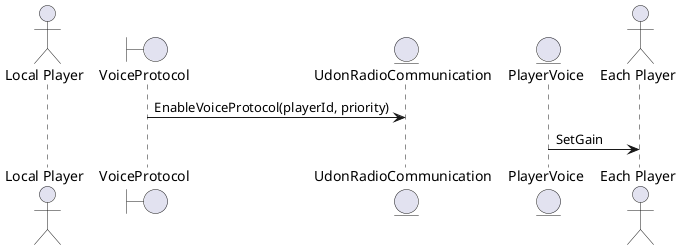

# アーキテクチャ概要

UdonRadioCommunications-Redux は、VRChat の UdonSharp を使用したモジュラー設計の音声通信システムです。システムは以下の主要コンポーネントで構成されています：

## コアシステム

- **UdonRadioCommunication**: システム全体の中央管理
- **VoiceProtocol**: 音声処理プロトコルの基底クラス
- **PlayerVoice**: 個別プレイヤーの音声設定管理

## チャンネルシステム

- **Transceiver**: 送受信両対応の無線機
- **Receiver**: 受信専用の無線機
- **VoiceBroadcastByChannel**: チャンネル別音声配信管理
- **LocalChannelObject**: ローカルチャンネルオブジェクト

## ゾーンシステム

- **VoiceZone**: 音声ゾーンの定義
- **VoiceSettingByZone**: ゾーン別音声設定

## SaccFlight統合

- **SFEXT_URC_VHF**: SaccFlight拡張メインクラス
- **DFUNC_URC_VHF_Rx/Tx**: 航空機用無線制御UI

## システム処理フロー

